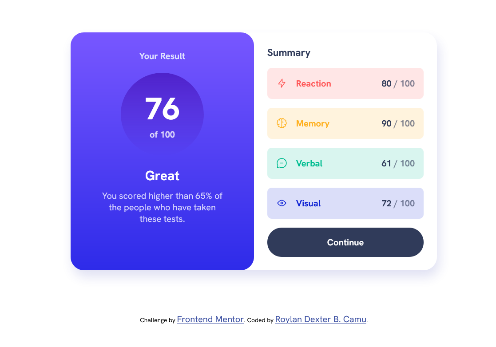
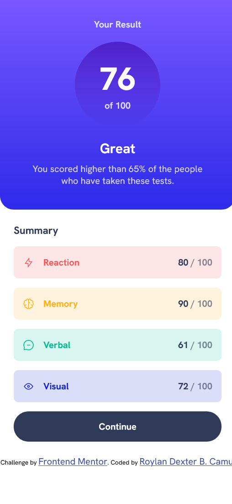
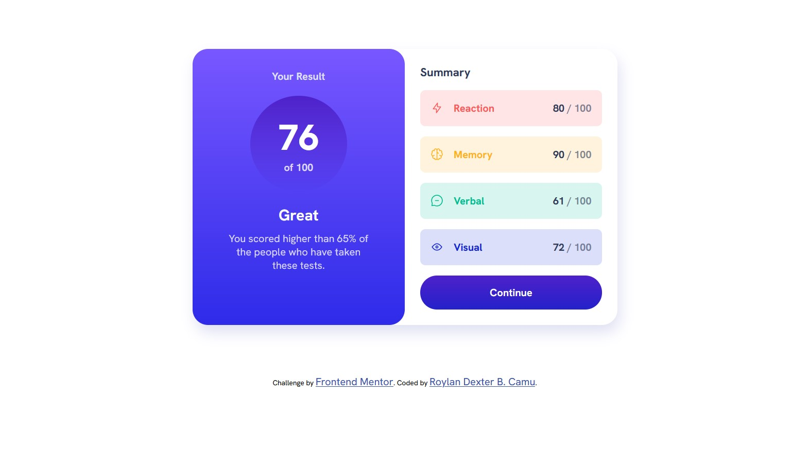

# Frontend Mentor - Results summary component solution

This is a solution to the [Results summary component challenge on Frontend Mentor](https://www.frontendmentor.io/challenges/results-summary-component-CE_K6s0maV). Frontend Mentor challenges help you improve your coding skills by building realistic projects. 

## Table of contents

- [Overview](#overview)
  - [The challenge](#the-challenge)
  - [Screenshot](#screenshot)
  - [Links](#links)
- [My process](#my-process)
  - [Built with](#built-with)
  - [What I learned](#what-i-learned)
  - [Continued development](#continued-development)
  - [Useful resources](#useful-resources)
- [Author](#author)

## Overview

### The challenge

Users should be able to:

- View the optimal layout for the interface depending on their device's screen size
- See hover and focus states for all interactive elements on the page

### Screenshot

### Links

- Live Site URL: [Link to the Site](https://rdcamu.github.io/frontendmentor-project5/)

## My process

### Built with

- CSS custom properties
- Flexbox
- CSS Grid
- Mobile-first workflow

### What I learned

I learned the basics of HTML and CSS. Like adding color, border, and other decorative properties to html elements. I also used both flexbox and grid to layout elements in the page. Aside from that, I also got introduced to concepts such as responsive web design and semantic HTML.

### Continued development

After this project, I am eager to learn more about ways to make the site responsive to different screen sizes. As well as increase the accessibility of the site. Additionaly, I want to explore modern CSS to create better layouts with efficiency and cleaner code. I also want to know how to use a pre-processor.

### Useful resources

- [HTML/CSS by supersimpledev](https://www.youtube.com/watch?v=G3e-cpL7ofc&t=22302s&pp=ygUXc3VwZXJzaW1wbGVkZXYgaHRtbCBjc3M%3D) - This helped me learn HTML and CSS in a clear and concise manner. His examples and exercises are top-notch. This course is very beginner friendly so I highly recommend this to anyone wanting to learn HTML/CSS.

- [HTML/CSS etc Documentation](https://developer.mozilla.org/en-US/) - This is a great resource if you want an in-depth description of html tags, elements, css properties, etc.

## Author

- Website - [Roylan Dexter Camu](https://rdcamu.github.io/)
- Frontend Mentor - [@RDCamu](https://www.frontendmentor.io/profile/RDCamu)

